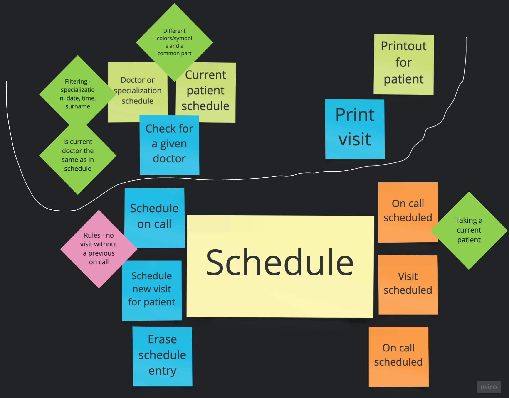

# Schedule domain - JUnit, Spock
One domain, 2 testing frameworks, 3 JVM languages.

## Problem
Mixing doctors and patients together:

At the beginning I thought about "override schedule entry" action, but it appeared it's simpler to erase something and create new entries instead.

## JUnit 5
Tests under `src/test/java`, ending with `Test`.

## Spock
Tests under `src/test/groovy`, ending with `Spec`. It's more convenient to use Spock with Groovy. I don't know how to use it with something else anyway...